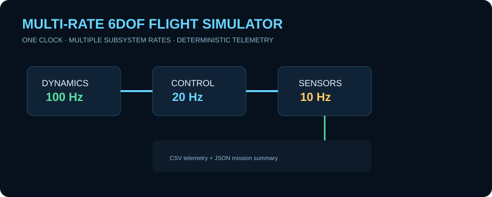
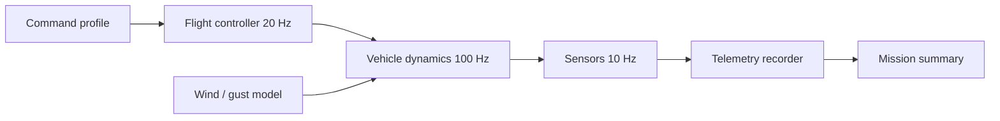

# Multi-Rate 6DOF Flight Simulator

  

A runnable synthetic aerospace simulation demonstrating a **deterministic multi-rate scheduler** for vehicle dynamics, flight control, sensor sampling, telemetry, and disturbance injection. The model is intentionally compact enough to understand end to end while still showing the timing problems that appear when simulation subsystems operate at different rates.

> Public educational project. Equations and parameters are generic and synthetic; this is not flight-qualified software and contains no operational weapon-system performance data.

<p align="center"></p>

## What is implemented

- six-state translational/attitude surrogate with roll, pitch, yaw, body-rate behavior, altitude, and airspeed
- 100 Hz vehicle dynamics loop
- 20 Hz flight-control loop
- 10 Hz sensor/telemetry loop
- one monotonic scheduler coordinating all subsystem updates
- actuator saturation and synthetic wind/gust disturbances
- deterministic scenario execution
- CSV telemetry and JSON mission summary products
- unit tests and GitHub Actions CI

## Architecture



## Repository layout

```text
Multi-Rate-6DOF-Flight-Simulator/
├── simulator.py
├── tests/
│   └── test_simulator.py
├── assets/
│   └── multirate-preview.svg
├── .github/workflows/ci.yml
├── pyproject.toml
└── README.md
```

## Quick start

No external simulation framework is required.

```bash
git clone https://github.com/skytruong90/Multi-Rate-6DOF-Flight-Simulator.git
cd Multi-Rate-6DOF-Flight-Simulator
python --version
python simulator.py --duration 20 --output artifacts
```

Run the tests:

```bash
python -m unittest discover -s tests -v
```

## Outputs

A normal run writes:

```text
artifacts/
├── telemetry.csv
└── summary.json
```

`telemetry.csv` is intended for plotting or downstream analytics. The JSON summary captures end-state and campaign-level metrics so a CI job can compare results without parsing console output.

## Engineering model

The simulator uses a single authoritative simulation clock. Each subsystem checks that clock against its next scheduled execution time rather than sleeping in wall-clock time. That distinction makes runs deterministic and fast while preserving the idea of asynchronous subsystem rates.

The dynamics surrogate combines thrust, drag, gravity, commanded attitude response, and a configurable gust contribution. The controller operates more slowly than the plant, and sensor sampling is slower again. Actuator commands are explicitly saturated so control requests cannot grow without bound.

## Validation strategy

The automated tests exercise deterministic results, scheduler cadence, disturbance behavior, output generation, and bounded commands. GitHub Actions runs the same suite on every push so the public repository demonstrates both the model and the verification path.

## What I learned / demonstrated

- how to coordinate different subsystem update rates without using wall-clock delays
- why one authoritative simulation clock is important for deterministic replay
- how controller and sensor rates can be decoupled from the integration rate
- how saturation and disturbance injection expose closed-loop behavior more realistically than a nominal-only run
- how to separate telemetry products from console logging so simulations remain automation-friendly

## Limitations

This is a low-order educational model, not a high-fidelity aerodynamic or rigid-body solver. It omits coefficient tables, full inertia coupling, actuator dynamics, high-fidelity atmosphere, navigation filters, coordinate-frame transformations, and hardware interfaces.

## Safety / data disclaimer

All data are synthetic. The repository is not operational, classified, validated against a real platform, or intended for targeting or weapon employment.