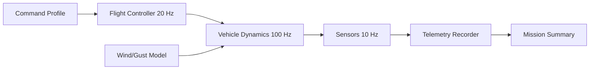

# Multi-Rate 6DOF Flight Simulator

A portfolio-grade synthetic aerospace simulation demonstrating a deterministic multi-rate scheduler for rigid-body flight dynamics, control, and sensor sampling. It uses generic public-domain equations and intentionally avoids real weapon-system parameters.

## Highlights

- 6-state translational/attitude surrogate with roll, pitch, yaw, body rates, altitude, and airspeed
- 100 Hz dynamics loop, 20 Hz controller, and 10 Hz sensor loop
- Deterministic event scheduling and telemetry generation
- Configurable wind gust injection and actuator saturation
- JSON mission summary and CSV telemetry output
- Automated unit tests and GitHub Actions CI



## Quick start

```bash
python simulator.py --duration 20 --output artifacts
python -m unittest discover -s tests -v
```

The simulator writes `artifacts/telemetry.csv` and `artifacts/summary.json`.

## Engineering model

The implementation is intentionally compact but non-trivial: translational acceleration is computed from thrust, drag, gravity, and a synthetic gust term; attitude channels are second-order rate-limited responses driven by a proportional controller. Different subsystems are scheduled at independent rates while sharing one monotonic simulation clock.

## Repository layout

- `simulator.py` — dynamics, controller, scheduler, telemetry, CLI
- `tests/test_simulator.py` — deterministic behavior and scheduler tests
- `.github/workflows/ci.yml` — cross-platform Python validation

## Safety / data disclaimer

This is an educational synthetic model. It is not flight-qualified, operational, classified, validated against a real platform, or intended for targeting or weapon employment.